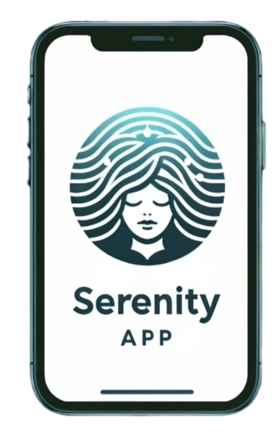

# Serenity APP

Wellness web app that helps relieve headaches through guided vibration patterns and relaxing ambient sounds. Place your phone on the affected area, start a session, and let the calibrated vibrations and audio work together.

<div align="center">
  
</div>

## Features

- **Pain analysis** — Guided questionnaire to assess headache type and intensity before starting a relief session
- **Vibration therapy** — Calibrated vibration patterns through the device's motor, designed to relax muscle tension
- **Relaxing audio** — Ambient sounds during sessions to complement physical relief
- **Session history** — Track your analyses and relief sessions over time
- **User accounts** — Register, login, and manage your profile with JWT authentication
- **Responsive design** — Custom wave-themed SVG backgrounds across desktop, tablet, and mobile

## Tech stack

**Frontend:**
- Vue 3 + Vue Router + Pinia
- Vuetify 3 (Material Design)
- Vite

**Backend:**
- Node.js + Express
- MongoDB + Mongoose
- JWT authentication via cookies

**Infrastructure:**
- Docker Compose (frontend + backend containers)

## Project structure

```
├── web/                # Vue.js frontend
│   ├── src/
│   │   ├── views/      # LandingPage, Home, Analisis, Aliviar, Profile...
│   │   ├── components/ # Navbar, Footer, shared UI
│   │   ├── stores/     # Pinia auth store
│   │   └── router/     # Route definitions
│   └── public/         # SVG backgrounds, logos
├── server/             # Express backend
│   ├── models/         # Mongoose schemas (User, Analisis, Alivio)
│   ├── controllers/    # Request handlers
│   ├── routes/         # API routes
│   └── middleware/     # JWT auth middleware
└── docker-compose.yml
```

## Running it

```bash
# With Docker
docker-compose up

# Or manually
cd server && npm install && node app.js
cd web && npm install && npm run dev
```

## Context

Built for the **Interacción Persona-Ordenador (IPO)** course at Universidad de Salamanca, 2024. Team project by Daniel Mulas, Tomás Pérez, and Mario Prieta.
