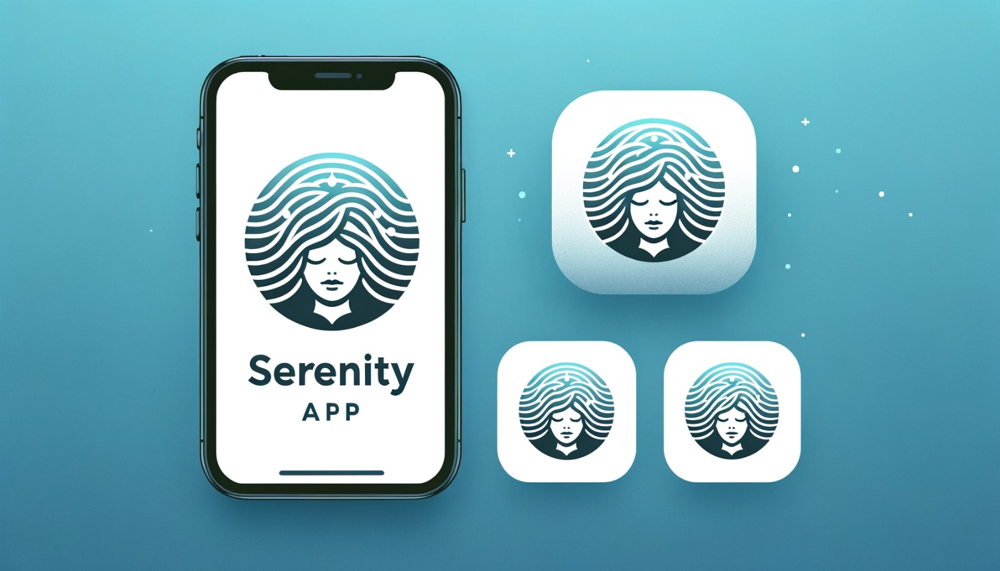
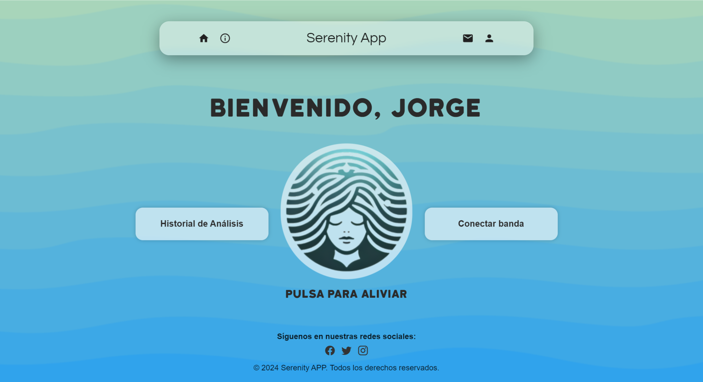
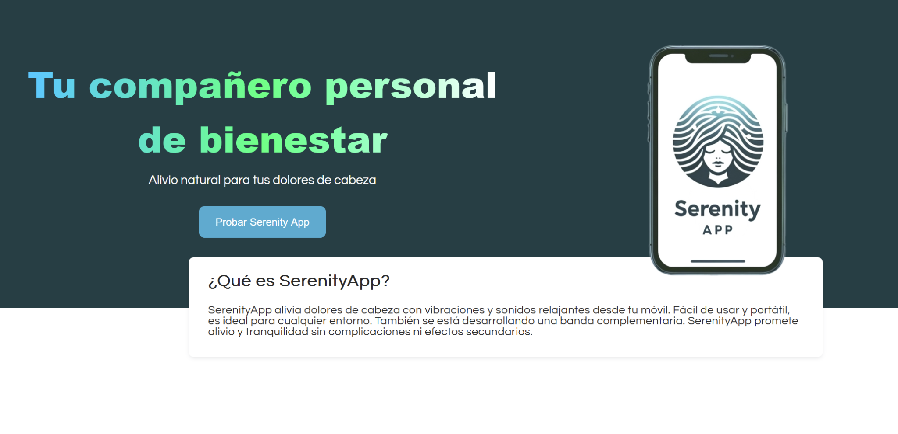
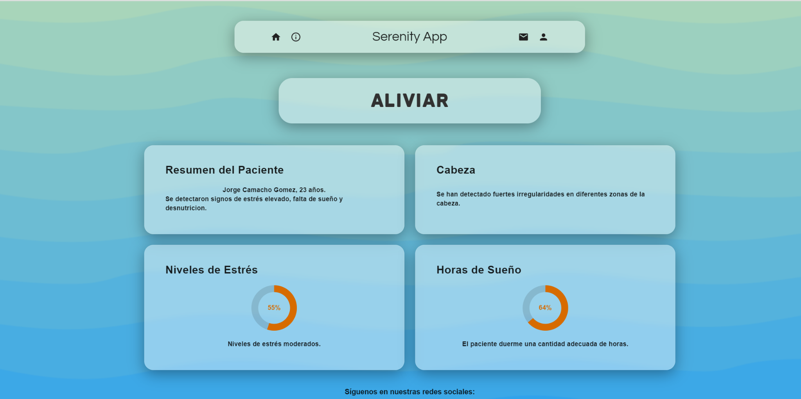
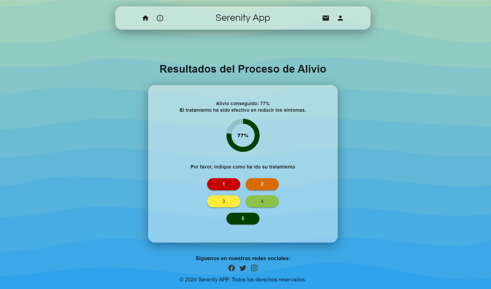
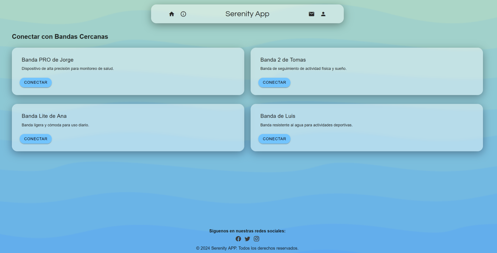
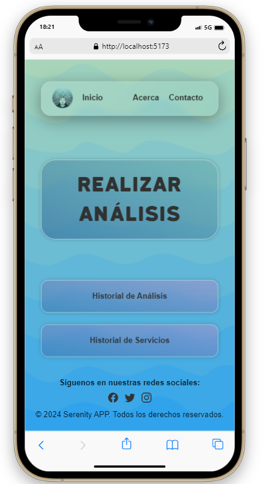
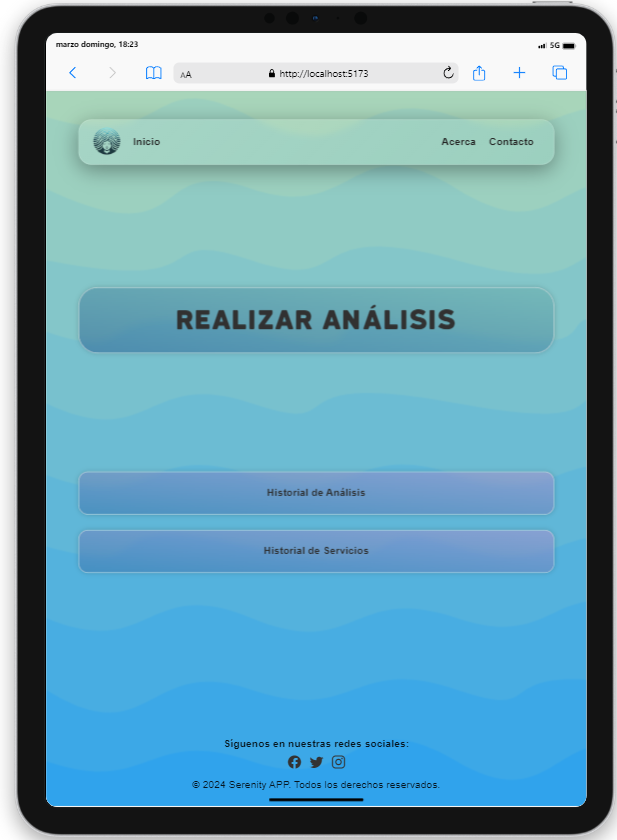

# Serenity APP

Wellness web app that relieves headaches through calibrated vibration therapy and relaxing ambient sounds. Born from real user research — interviews with students, teachers, and workers revealed that headaches from stress and fatigue were a universal pain point with no convenient non-pharmaceutical solution.

The app uses the device's vibration motor to apply therapeutic patterns based on the [Gate Control Theory of Pain](https://en.wikipedia.org/wiki/Gate_control_theory), while ambient melodies create a calming environment for recovery.

<div align="center">
  
</div>

## How it works

The core flow is designed to be as simple as possible — inspired by [Shazam](https://www.shazam.com/)'s one-tap interaction. A user with a headache shouldn't have to navigate complex menus.

1. **Tap the logo** to start a pain analysis session
2. The app detects the type and intensity of the headache using guided input
3. AI-generated vibration patterns are calibrated to your specific pain profile
4. Place the device on the affected area and let the vibrations + audio work together
5. Rate your experience (1-5) and the session is saved to your history

<div align="center">
  
</div>

## Features

- **Pain analysis** — Guided assessment to identify headache type, location, and intensity before generating a personalized vibration pattern
- **Vibration therapy** — Patterns based on the Gate Control Theory of Pain (Melzack & Wall), designed to relax muscle tension and improve blood circulation
- **Relaxing audio** — Ambient melodies during sessions to complement the physical relief and reduce cortisol levels
- **Session history** — Track all your analyses and relief sessions over time with detailed results
- **Serenity Band** — Bluetooth-compatible headband accessory that wraps vibrations around the full head for 3x more effective relief than phone-only sessions
- **User accounts** — Register, login, edit profile, and change password with JWT authentication
- **Quick feedback** — 1-5 rating system after each session (replaced text feedback based on user testing)
- **100% responsive** — Custom wave-themed SVG backgrounds adapted for desktop, tablet, and mobile

## Screenshots

<div align="center">

**Landing Page**



**Analysis Results**



**Relief Results & Feedback**



**Serenity Band — Bluetooth Connection**



</div>

### Responsive design

<div align="center">
  
  &nbsp;&nbsp;&nbsp;&nbsp;
  
</div>

## Design process

The project followed a full HCI (Human-Computer Interaction) methodology over 3 iterative versions:

**v1 — Initial concept**
- Blue wave backgrounds from [Superdesigner](https://superdesigner.co/tools/backgrounds), calming color palette (#efeff0 to #73aaf7)
- Custom logo: waves forming the hair of a meditating figure, symbolizing vibration + calm
- Typographies: KatahdinRound (titles) + Questrial (body) — chosen for their rounded, serene feel

**v2 — Post heuristic evaluation**
- Reduced blue saturation (feedback: "too much blue"), introduced green-mint tones (#63aeec to #abd6c7)
- Redesigned landing page with dark header (#273e44), gradient title, and phone mockup
- Shazam-inspired main button: animated breathing logo that replaces the old rectangular button
- White semi-transparent cards instead of blue-on-blue
- Added login from landing page, logout button, and back navigation

**v3 — Post user testing**
- Replaced text feedback with 1-5 rating buttons (doubles as "return to home")
- Added "Pulsa para aliviar" label under the main button for first-time clarity
- Merged "Historial de Análisis" and "Historial de Servicios" into a single history view
- Added Bluetooth band connection feature to the home screen
- Contrast-verified button colors (#4ABDFD on black = 9.99 contrast ratio)

## Tech stack

**Frontend** — Vue 3, Vue Router, Pinia, Vuetify 3 (Material Design), Vite

**Backend** — Node.js, Express, MongoDB + Mongoose, JWT authentication via cookies

**Infrastructure** — Docker Compose (frontend + backend containers)

## Project structure

```
├── web/                  # Vue.js frontend
│   ├── src/
│   │   ├── views/        # Landing, Home, Analisis, Aliviar, Profile, Conectar...
│   │   ├── components/   # Navbar, Footer, Use
│   │   ├── stores/       # Pinia auth store
│   │   ├── router/       # Route definitions
│   │   └── assets/       # Fonts, logos, SVGs
│   └── public/           # Wave backgrounds (desktop, tablet, mobile variants)
├── server/               # Express backend
│   ├── models/           # Mongoose schemas (User, Analisis, Alivio)
│   ├── controllers/      # Request handlers
│   ├── routes/           # API routes
│   └── middleware/        # JWT auth middleware
└── docker-compose.yml
```

## Running it

```bash
# With Docker
docker-compose up

# Or manually
cd server && npm install && node app.js
cd web && npm install && npm run dev
```

## Context

Built for the **Interaccion Persona-Ordenador (IPO)** course at Universidad de Salamanca, 2024. The project went through a complete HCI cycle: needfinding interviews, elevator pitch, conceptualization, 2 heuristic evaluations, 2 user tests, and 3 iterative versions.

Team: Daniel Mulas, Tomas Perez, and Mario Prieta.
